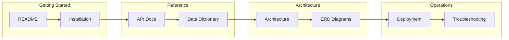

# Documentation Index

> Auto-generated documentation catalog
> Generated: $(date -u +%Y-%m-%d %H:%M:%S UTC)

## Quick Navigation

| Document | Description | Status |
|----------|-------------|--------|
| [README](../../README.md) | Project overview | Core |
| [Architecture](diagrams/ARCHITECTURE.md) | System architecture diagrams | Auto |
| [Data Dictionary](DATA_DICTIONARY.md) | Data model reference | Auto |
| [Folder Structure](diagrams/FOLDER_STRUCTURE.md) | Repository structure | Auto |
| [API Reference](API_REFERENCE.md) | API documentation | Manual |
| [Deployment Guide](DEPLOYMENT_GUIDE.md) | Deployment instructions | Manual |

## Documentation Map

## Auto-Generated vs Manual Documentation

- **Auto-Generated**: Updated automatically by CI/CD pipeline
- **Manual**: Requires human updates, reviewed periodically

## Contributing to Documentation

1. For auto-generated docs: Update source files and CI will regenerate
2. For manual docs: Create PR with changes to `docs/` folder
3. Follow the documentation style guide in `.design/`

