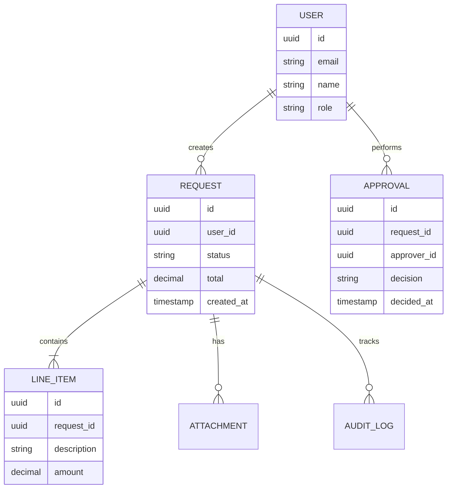
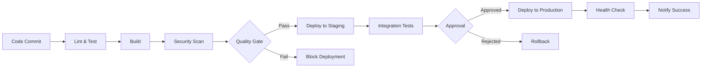

# Complete Documentation

## Document Information

**Project**: {{PROJECT_NAME}}
**Description**: {{PROJECT_DESCRIPTION}}
**Version**: {{VERSION}}
**Generated**: {{DATE}}
**Owner**: {{OWNER}}
**Repository**: {{REPO}}

---

## Overview

This comprehensive documentation package includes:

1. **Executive Summary** - High-level project overview
2. **Technical Documentation** - Detailed technical specifications
3. **Architecture Decision Records** - Design rationale and decisions
4. **API Reference** - Complete API documentation
5. **Database Documentation** - Schema and data dictionary
6. **Security Documentation** - Security model and compliance
7. **Deployment Guide** - Deployment procedures and runbooks
8. **Testing Documentation** - Test strategy and coverage
9. **Operations Guide** - Monitoring, maintenance, and troubleshooting

---

## Project Context

### Business Drivers

{{PROJECT_NAME}} was developed to address the following business needs:

- **Efficiency**: Streamline manual processes
- **Accuracy**: Reduce human error through automation
- **Compliance**: Meet regulatory requirements
- **Scalability**: Support organisation growth
- **User Experience**: Improve staff productivity

### Success Criteria

The project will be considered successful when:

1. ✓ All functional requirements are met
2. ✓ System performance meets or exceeds targets
3. ✓ Security audit passes with no critical findings
4. ✓ User acceptance testing completed successfully
5. ✓ Documentation is comprehensive and current

### Stakeholders

| Stakeholder | Role | Interest |
|-------------|------|----------|
| Executive Team | Sponsors | ROI and strategic alignment |
| Development Team | Builders | Technical implementation |
| End Users | Consumers | Usability and functionality |
| IT Operations | Maintainers | Stability and supportability |
| Security Team | Auditors | Compliance and risk |

---

## Technical Summary

### Technology Stack

**Frontend**
- Framework: React 18.x / Vue 3.x / Angular 16.x
- Language: TypeScript 5.x
- Styling: Tailwind CSS / Material-UI
- State Management: Redux / Zustand / Pinia
- Testing: Jest, React Testing Library

**Backend**
- Runtime: Node.js 20.x LTS / Python 3.11 / .NET 8
- Framework: Express / FastAPI / ASP.NET Core
- Database: PostgreSQL 15+ / SQL Server 2022
- Cache: Redis 7+
- Queue: RabbitMQ / Azure Service Bus

**Infrastructure**
- Cloud: Azure / AWS / On-Premise
- CI/CD: GitHub Actions / Azure DevOps
- Monitoring: Application Insights / Datadog
- Security: OWASP ZAP, Snyk, CodeQL

### System Architecture

The application follows a layered architecture pattern:

```
┌────────────────────────────────────────┐
│     Presentation Layer (UI/API)        │
├────────────────────────────────────────┤
│     Application Layer (Business Logic) │
├────────────────────────────────────────┤
│     Domain Layer (Core Models)         │
├────────────────────────────────────────┤
│     Infrastructure Layer (Data/Cache)  │
└────────────────────────────────────────┘
```

**Key Architectural Principles:**
- Separation of Concerns
- Dependency Inversion
- Single Responsibility
- Don't Repeat Yourself (DRY)
- SOLID Principles

---

## Data Model

### Core Entities

The system manages the following core entities:

1. **Users** - System users and authentication
2. **Requests** - Primary business object
3. **Line Items** - Request details and breakdowns
4. **Approvals** - Workflow and approval tracking
5. **Attachments** - Document management
6. **Audit Logs** - Change tracking and compliance

### Entity Relationships



### Data Dictionary

#### Users Table

| Column | Type | Constraints | Description |
|--------|------|-------------|-------------|
| id | UUID | PK | Unique identifier |
| email | VARCHAR(255) | UNIQUE, NOT NULL | User email address |
| full_name | VARCHAR(255) | NOT NULL | Display name |
| role | VARCHAR(50) | NOT NULL | User role (admin, user, etc.) |
| is_active | BOOLEAN | DEFAULT true | Account status |
| created_at | TIMESTAMP | DEFAULT NOW() | Creation timestamp |
| updated_at | TIMESTAMP | DEFAULT NOW() | Last update timestamp |

---

## API Documentation

### Authentication

**Endpoint**: `POST /api/auth/login`

**Request:**
```json
{
  "email": "user@example.com",
  "password": "secure-password"
}
```

**Response:**
```json
{
  "accessToken": "eyJhbGc...",
  "refreshToken": "eyJhbGc...",
  "expiresIn": 3600,
  "user": {
    "id": "uuid",
    "email": "user@example.com",
    "name": "John Smith",
    "role": "user"
  }
}
```

### Core Endpoints

| Method | Endpoint | Description |
|--------|----------|-------------|
| GET | /api/requests | List requests |
| POST | /api/requests | Create request |
| GET | /api/requests/:id | Get request details |
| PUT | /api/requests/:id | Update request |
| DELETE | /api/requests/:id | Delete request |
| POST | /api/requests/:id/submit | Submit for approval |
| POST | /api/requests/:id/approve | Approve request |
| POST | /api/requests/:id/reject | Reject request |

### Response Formats

**Success Response:**
```json
{
  "success": true,
  "data": { ... },
  "meta": {
    "timestamp": "2025-12-08T10:30:00Z",
    "requestId": "correlation-id"
  }
}
```

**Error Response:**
```json
{
  "success": false,
  "error": {
    "code": "ERROR_CODE",
    "message": "Human-readable error message",
    "details": [ ... ]
  }
}
```

---

## Security

### Authentication & Authorisation

- **Method**: JSON Web Tokens (JWT)
- **Token Storage**: HTTP-only cookies
- **Token Lifetime**: 1 hour (access), 7 days (refresh)
- **Multi-Factor Authentication**: Optional via authenticator app

### Role-Based Access Control

| Role | Permissions |
|------|-------------|
| Admin | Full system access, user management |
| Manager | Approve requests, view team data |
| User | Create/edit own requests |
| Viewer | Read-only access |

### Data Protection

- **Encryption in Transit**: TLS 1.3
- **Encryption at Rest**: AES-256
- **PII Handling**: Field-level encryption
- **Data Retention**: 7 years for audit compliance

### Security Scanning

- **OWASP ZAP**: Automated security scanning (weekly)
- **Snyk**: Dependency vulnerability scanning (daily)
- **CodeQL**: Static code analysis (on PR)
- **Secret Scanning**: GitHub secret detection (enabled)

---

## Deployment

### Environment Strategy

| Environment | Purpose | Deployment Trigger |
|-------------|---------|-------------------|
| Development | Daily development work | On commit to dev branch |
| Staging | Pre-production testing | On PR to main |
| Production | Live system | Manual approval after staging tests |

### Deployment Pipeline



### Rollback Procedures

If deployment issues occur:

1. **Immediate**: Rollback to previous version (automated)
2. **Database**: Restore from last known good backup
3. **Notify**: Alert stakeholders via Teams/Email
4. **Document**: Create incident report
5. **Review**: Post-mortem analysis

---

## Testing

### Test Coverage

| Category | Coverage | Target |
|----------|----------|--------|
| Unit Tests | 85% | 80% |
| Integration Tests | 75% | 70% |
| E2E Tests | 60% | 60% |
| API Tests | 90% | 80% |

### Test Environments

- **Local**: Developer machines
- **CI**: GitHub Actions runners
- **Staging**: Pre-production environment with test data

### Regression Testing

- **Baseline Directory**: `.github/baselines/`
- **Trigger**: On every PR
- **Scope**: API responses, UI snapshots, performance metrics

---

## Operations

### Monitoring

**Application Metrics:**
- Request rate and latency
- Error rates by endpoint
- Database query performance
- Cache hit rates

**Infrastructure Metrics:**
- CPU and memory utilisation
- Disk I/O and storage
- Network throughput
- Container health

**Business Metrics:**
- Active users
- Request submissions
- Approval rates
- SLA compliance

### Alerting Thresholds

| Metric | Warning | Critical |
|--------|---------|----------|
| API Response Time | >500ms | >1000ms |
| Error Rate | >1% | >5% |
| CPU Usage | >70% | >90% |
| Memory Usage | >80% | >95% |
| Disk Space | >75% | >90% |

### Maintenance Windows

- **Scheduled**: Sunday 02:00-04:00 AEST
- **Emergency**: As required with 1-hour notice
- **Communication**: Email + Teams notification

### Backup Strategy

- **Frequency**: Daily at 01:00 AEST
- **Retention**: 30 days daily, 12 months monthly
- **Storage**: Geo-redundant cloud storage
- **Testing**: Monthly restore validation

---

## Troubleshooting

### Common Issues

#### Application Won't Start

**Symptoms:** Service fails to start, health check fails

**Resolution:**
1. Check environment variables are set
2. Verify database connectivity
3. Check disk space and memory
4. Review application logs
5. Verify configuration files

#### Database Connection Errors

**Symptoms:** Connection timeout, authentication failures

**Resolution:**
1. Verify database is running
2. Check connection string
3. Validate credentials
4. Review firewall rules
5. Check connection pool settings

#### High Memory Usage

**Symptoms:** Application slow, OOM errors

**Resolution:**
1. Analyse heap dumps
2. Check for memory leaks
3. Review query performance
4. Optimise data caching
5. Scale resources if needed

### Support Contacts

| Issue Type | Contact | Response Time |
|------------|---------|---------------|
| Critical Production | On-call team | 15 minutes |
| Non-critical Production | Support desk | 2 hours |
| Development | Development team | 1 business day |
| Security | Security team | Immediate |

---

## Appendices

### Appendix A: Glossary

- **ADR**: Architecture Decision Record
- **API**: Application Programming Interface
- **JWT**: JSON Web Token
- **RBAC**: Role-Based Access Control
- **SLA**: Service Level Agreement
- **TLS**: Transport Layer Security

### Appendix B: References

- [OWASP Top 10](https://owasp.org/www-project-top-ten/)
- [REST API Best Practices](https://restfulapi.net/)
- [PostgreSQL Documentation](https://www.postgresql.org/docs/)
- [React Documentation](https://react.dev/)

### Appendix C: Change History

| Version | Date | Author | Changes |
|---------|------|--------|---------|
| 1.0.0 | {{DATE}} | {{AUTHOR}} | Initial documentation |

---

**Document Classification**: Internal
**Review Frequency**: Quarterly
**Next Review**: Q1 2026
**Maintained By**: Development Team
